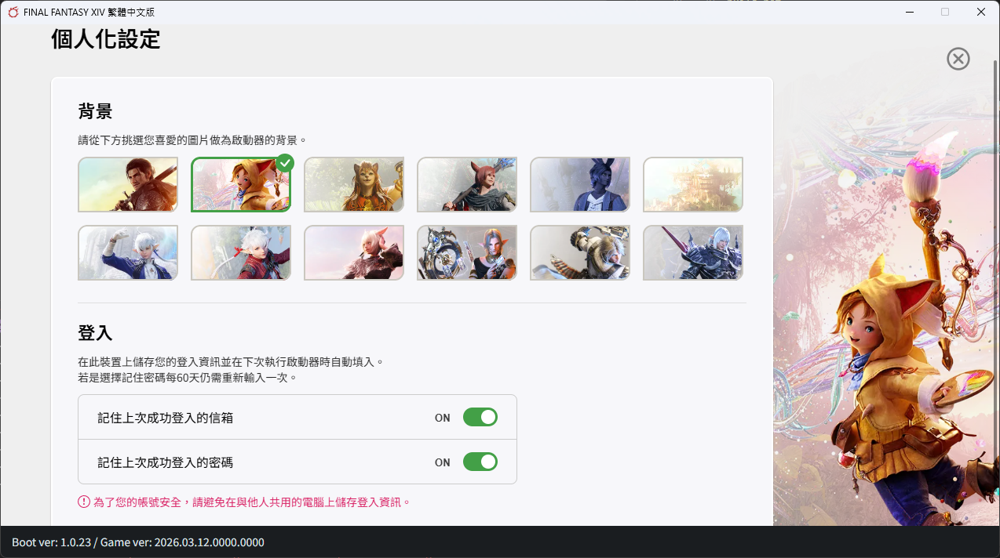

# FFXIV OTP 自動登入工具

自動產生 TOTP 驗證碼並填入 FINAL FANTASY XIV 繁體中文版啟動器，省去每次手動輸入的麻煩。

## 功能

- 產生 TOTP 驗證碼（相容 Google Authenticator）
- 自動填入啟動器的一次性驗證碼欄位並登入
- 支援直接從工具啟動遊戲
- 密鑰以 Windows DPAPI 加密儲存
- 支援 Base32 密鑰或 `otpauth://` 網址格式
- 設定自動儲存

## 下載

前往 [Releases](../../releases) 頁面下載最新的 `FFXIV_OTP_Login.exe`。

## 使用方式

1. 執行 `FFXIV_OTP_Login.exe`
2. 首次使用時，貼上你的 TOTP 密鑰（Base32 字串或 `otpauth://` 網址）
3. 在進階設定中設定啟動器路徑（點「瀏覽」選擇你的啟動器 exe）
4. 打開 FFXIV 啟動器，確認帳號密碼已填好，且焦點在驗證碼欄位
5. 按「自動登入」，工具會自動填入驗證碼並登入

也可以直接按「啟動遊戲」從工具開啟啟動器。

## 從原始碼執行

```bash
pip install -r requirements.txt
python main.py
```

## 自行打包

```bash
pip install -r requirements.txt
build.bat
```

產出的 exe 在 `dist/FFXIV_OTP_Login.exe`。

## 注意事項

- 密鑰以 Windows DPAPI 加密，綁定你的 Windows 帳號，其他人無法解密
- 本工具不會進行任何網路連線
- 建議開啟啟動器的「記憶信箱及密碼」功能，這樣每次開啟時焦點會自動在驗證碼欄位


